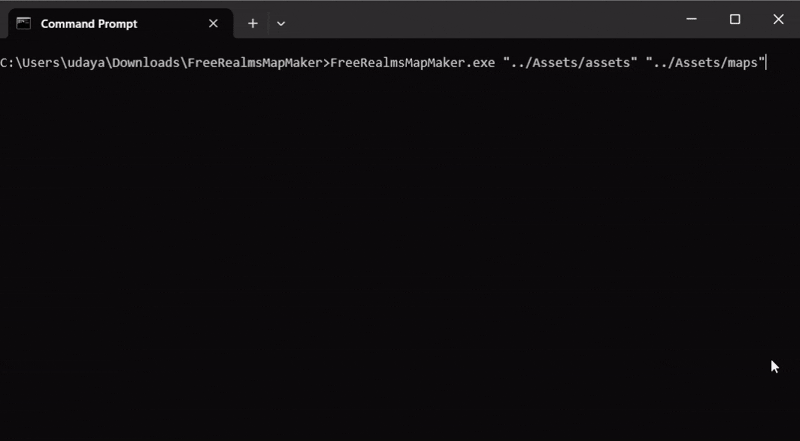

# FreeRealmsMapMaker

A console application that lets you create maps from Free Realms tile assets.

## Requirements

Must have [.NET 8.0+](https://dotnet.microsoft.com/en-us/download/dotnet/8.0) for Windows installed.

## Introduction

Simply place your `*_TileInfo.txt` and `*_Tile_*.dds` files (i.e., `FabledRealms_TileInfo.txt` and `FabledRealms_Tile_000_-08_0_0.dds`) in the same directory and pass it as the first argument to `FreeRealmsMapMaker.exe`. The second argument specifies where to create the maps.

For example,

```
FreeRealmsMapMaker.exe "../Assets/assets" "../Assets/maps"
```



## Usage

```
Usage: FreeRealmsMapMaker [options] <InputDirectory> <OutputDirectory>

Arguments:
  InputDirectory                  The input directory containing the TileInfo.txt/tile files.
  OutputDirectory                 The output directory to put the map files.
                                  Default value is: ./maps.

Options:
  -f|--format <FORMAT>            The image format of the output map.
                                  Default value is: .png.
  -m|--max-threads <MAX_THREADS>  The maximum number of threads to use.
                                  By default (-1), there is no upper limit.
                                  Default value is: -1.
  -?|-h|--help                    Show help information.
```

## Credits

* Icon by [surang](https://www.freepik.com/icon/game-map_3862772).
* Bitmap support for [.dds files](src/FreeRealmsMapMaker/Dds) acquired from [Shendare](https://github.com/Shendare)'s [DDSImage.cs](https://github.com/Shendare/EQZip/blob/master/DDSImage.cs).
